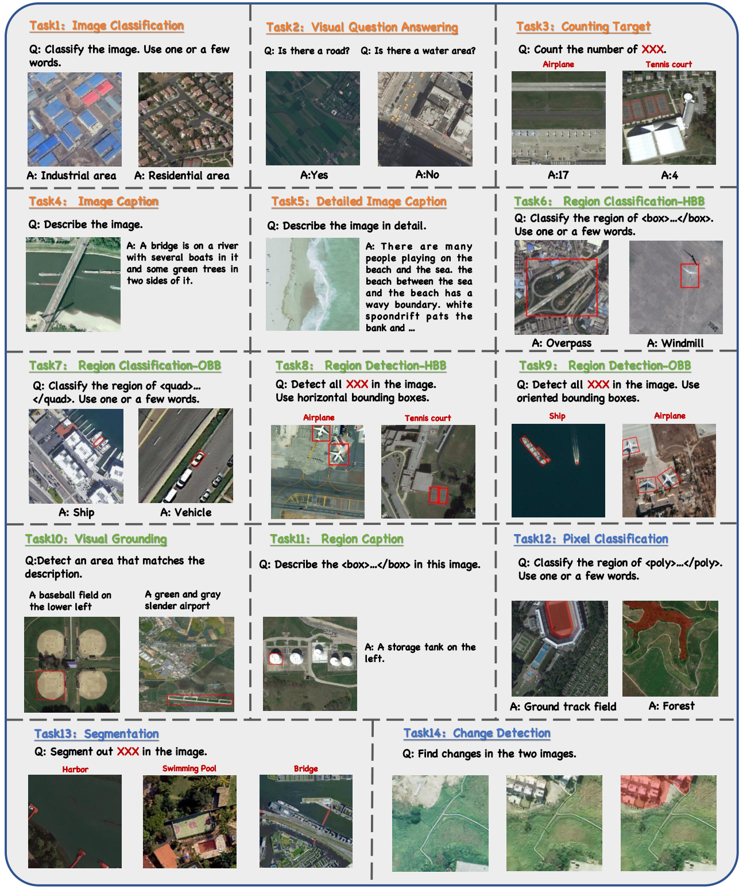

<div align="center">

#  Falcon: A Remote Sensing Vision-Language Foundation Model

<div align="center">
  
  <br>
</div>

[\[🚀 Quick Start\]](#quick-start-with-Falcon)


</div>

## Introduction
We are excited to introduce Falcon, which offers a unified, prompt-based paradigm that effectively executes comprehensive and complex remote sensing vision tasks. Falcon demonstrates powerful understanding and reasoning abilities at the image, region, and pixel levels. Specifically, given simple natural language instructions and remote sensing images, Falcon can produce impressive results in text form across 14 distinct tasks, i.e., image classification, object detection, segmentation, image captioning, and etc.

\<place our GIF here\>

## News 🚀🚀🚀

- `2024/11/27`: Falcon has been released. The model checkpoints is now available on HuggingFace, and both training / evaluation data and scripts are open-sourced.


## Model Zoo

<table>
  <tr>
    <th>Model Name</th>
    <th>HF&nbsp;Link</th>
    <th>MS&nbsp;Link</th>
  </tr>
  <tr>
    <td>Falcon-Single-Instruction-0.7B</td>
    <td><a href="https://huggingface.co/OpenGVLab/InternVL2-1B">🤗 link</a></td>
    <td><a href="https://modelscope.cn/models/OpenGVLab/InternVL2-1B">🤖 link</a></td>
  </tr>
  <tr>
    <td>Falcon-Multi-Instruction-0.7B</td>
    <td><a href="https://huggingface.co/OpenGVLab/InternVL2-1B">🤗 link</a></td>
    <td><a href="https://modelscope.cn/models/OpenGVLab/InternVL2-1B">🤖 link</a></td>
  </tr>
  <tr>
    <td>Falcon-Single-Instruction-0.3B</td>
    <td><a href="https://huggingface.co/OpenGVLab/InternVL2-1B">🤗 link</a></td>
    <td><a href="https://modelscope.cn/models/OpenGVLab/InternVL2-1B">🤖 link</a></td>
  </tr>
</table>

## What can Falcon do?


## Quick Start with Falcon

<details>
  <summary>Installation (click to expand)</summary>
You can use the following script to install the environment：

```bash
conda create -n falon python=3.10
conda activate falcon
pip install -r requirements.txt
```
Optionally, we also provide a Docker image in [here](https://hub.docker.com/r/tianhuilab/falcon/tags) for fast deployment of the environment.
</details>

<details>
  <summary>Datasets preperation (click to expand)</summary>

Download FCD-78M dataset which can be found in [here](https://modelscope.cn/models/OpenGVLab/InternVL2-1B). Then, unzip and place/link the dataset at the root path of this repo. The directory structure should be as follows:
```bash
|-FCD
|----json_train_taskall
|    |---train_task14_all.json
|----Task01_IMG_CLS
|    |---test
|    |---train
|----Task02_IMG_CAP
|    |---test
|    |---train
|----Task03_IMG_CAP_DETAILED
|    |---test
|    |---train
...
```

</details>

<details>
  <summary>Training Falcon with FCD-78M (click to expand)</summary>

1. Download the checkpoints you want and place them at the root path of this repo. The directory structure should be as follows:
```bash
|-model_checkpoints
|----Falcon-Single-Instruction-0.7B
|    |---pytorch_model.bin
|    ...
|----Falcon-Multi-Instruction-0.7B
|    |---pytorch_model.bin
|    ...
|...
```

2. Here we give an example of a training script used for single instruction training. You may runing this script on master machine node and every slave machine node you have. Note that some parameters in this script should be modified according to the machine node on which it is running.

```bash
RANK=0 # The node idx of current machine node
WORLD_SIZE=1 # The total number of machine node
GPU_NUM=8 # The number of gpu in each machine node
MASTER_ADDR=localhost # The IP address of the master machine node
MASTER_PORT=12355 # The port of the master machine node

python multi_node_distributed_train.py \
    --node_rank $RANK \
    --local_size $GPU_NUM
    --world_size $(($GPU_NUM*$WORLD_SIZE)) \
    --master_addr $MASTER_ADDR \
    --master_port $MASTER_PORT \
    --checkpoint_path model_checkpoints/<checkpoint_dir_name> \  # choose the checkpoint you want
    --dataset FCD-78M \
    --label_json FCD/json_train_taskall/train_task14_all.json \
    --num_workers 2 \
    --batch_size 7 \  # Adjust this value according to your GPU memory
    --epochs 3 \
    --run_name <name_of_training_task>    # edit the name of this training task
```
</details>

<details>
  <summary>Evaluating Falcon with FCD-78M (click to expand)</summary>

1. Here we provide an example of the evaluation program to evaluate Falcon using FCD-78M dataset with the json annotation file.

```bash
GPU=0
CUDA_VISIBLE_DEVICES=$GPU python single_gpu_inference_eval.py \
    --model-path model_checkpoints/<checkpoint_dir_name> \
    --eval-file Datasets/test_label/single_instruction_conversation_test.json \
    --dataset-path FCD-78M \
    --model-name Falcon \
    --result-path ./ \
    --batch_size 8 \  # Adjust this value according to your GPU memory
    --num_workers 2 \
```

2. Running Evaluation Scripts for Single File and Batch Processing. To calculate evaluation metrics using the evaluation.py script, follow the commands below depending on whether you want to process a single file or all files in a folder.
   
 - `Process a Single Evaluation File` Run the command below, replacing "eval/tmp/model/falcon_CLS.json" with the path to your evaluation file and "falcon" with your model name:

```bash
python eval/evaluation.py \
    --evaluation-file eval/tmp/model/falcon_CLS.json \
    --model_name falcon
```
- `Process All Evaluation Files in a Folder` Run the command below, replacing "eval/tmp/model/" with the path to the folder containing your evaluation files and "falcon" with your model name:

```bash
python eval/evaluation.py \
    --evaluation-folder eval/tmp/model/ \
    --model_name falcon
```
</details>

## License

This project is released under the [MIT license](LICENSE). Parts of this project contain code and models from other sources, which are subject to their respective licenses.

## Citation

If you find this project useful in your research, please consider cite:

```BibTeX
@article{yao2025falcon,
  title={Falcon: A Remote Sensing Vision-Language Foundation Model},
  author={kelu, Yao and Nuo, Xu and Rong, Yang and Yingying, Xu and Titinunt, Kitrungrotsakul and Zhuoyan, Gao and yi, Ren and Jin, Wang and Ning, Wei and Chao, Li},
  journal={arXiv preprint arXiv:XXXX.XXXXX},
  year={2025}
}
```

## Acknowledgement

Falcon is built with reference to the code of the following projects: [Florence-2-base-ft](https://huggingface.co/microsoft/Florence-2-base-ft), [Florence-2-large-ft](https://huggingface.co/microsoft/Florence-2-large-ft), [florence2-finetuning](https://github.com/andimarafioti/florence2-finetuning). Thanks for their awesome work!
